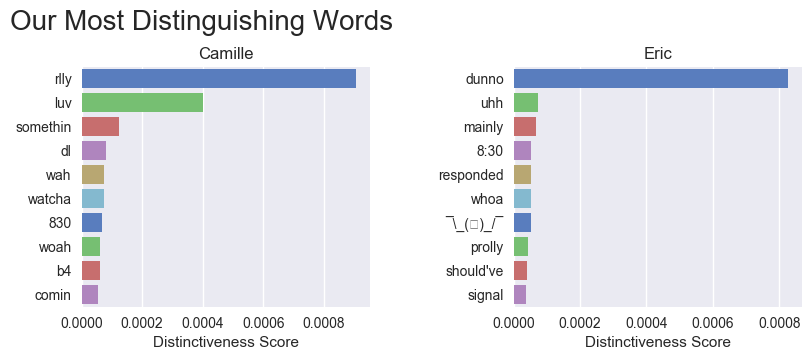
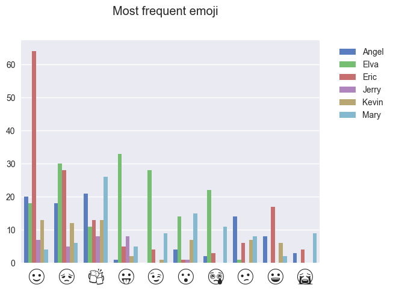

# ChatStats

ChatStats is a data visualizer for a Facebook Messenger conversation. Try it out with your group chats or your significant other. You don't need to be an experienced programmer to use it!



ChatStats also works with group chats!



More examples can be found in [my blog post](http://ericbai.co/i-made-some-data-visualizations-for-my-girlfriend/).

## Graphs

* Average number of words per message
* Days with the most messages
* Each sender's most distinguishing words
* Each term's most distinguishing words
* Messages by hour of day
* Messages by term
* Messages by weekday
* Most frequent stickers
* Names said in chat
* Number of messages sent

And more!

## How To

Note: Not tested on Windows.

### Pre-requisites

You will need the following installed:

* [Git](https://git-scm.com/book/en/v2/Getting-Started-Installing-Git)
* [Python3](https://www.python.org/getit/)
* Pip3 (should be included when installing Python3)

### Step One: Getting Your Facebook Data

To get your entire chat history:

1. Go to [https://www.facebook.com/dyi](https://www.facebook.com/dyi). Select **"Download Your Information"**.
2. On this page, change the Format option to `JSON`. You can deselect all information except for `Messages` to lower the size of your download. The other options can be left default or customized to your liking. Click `Create File` to continue.
3. Facebook takes a few minutes to generate a download link for you. Once you receive a notification from Facebook with a download link, save the file to your computer and unzip it. You can do **Step Two** while waiting for the file to download.
4. You may be given more than one zip you must combine these zips when extracting in to one folder structure

Note that your Facebook data contains very sensitive information, so be careful storing it.

### Step Two: Set Up ChatStats

1. Clone or fork this repository:
```
git clone https://github.com/baieric/chatstats.git
```
2. Install the dependencies:
```
python3 -m pip install -r requirements.txt
```
(If this fails, try running with `sudo` at the front.)

### Step Three: Generate Graphs!

1. Go to your Facebook messages folder, and find the folder containing the chat you want to use.
2. Use the path of that folder to run the following command:
```
python3 chatstats.py <chat_folder>
```
This creates a folder in `chatstats/my_data/` with your ChatStats graphs.

Have fun! If you need help deciding what conversations to try, [sort your `messages` folder by size](http://dailymactips.com/display-the-size-of-all-your-folders-in-the-mac-finder-window/). Try it out on all of your largest conversations!

### Advanced Configuration

There are some advanced options available in the file `config.py`.

## Something Not Working?

Facebook's Download Your Information tool sometimes updates the format of your data, which can break this tool. If you notice something, please file an issue or make a pull request!

## Contribute

Feel free to [request a feature](https://github.com/baieric/chatstats/issues/new) or make a pull request. There are ideas for bug fixes, improvements, and new graphs in [the project roadmap](https://github.com/baieric/chatstats/blob/master/ROADMAP.md).

### Getting Started With the Codebase

To create a new graph, create a new `Grapher` object in `grapher.py`. The file has many examples to help you get started.

ChatStats uses graphers in this code snippet from `chatstats.py`:
```
# generate graphs that use message data
messages = clean_data(pd.DataFrame(json_data["messages"]))
for grapher in message_graphers:
    grapher.graph(messages, output_folder, parent_folder)

# generate graphs that use word data
words = word_data(messages)
for grapher in word_graphers:
    grapher.graph(words, output_folder, parent_folder)
```

Here we create two different dataframes, `messages` and `words`, which are called by graphers in corresponding `message_graphers` and `word_graphers` lists. For ChatStats to use a newly created grapher, it must be added to the appropriate list.

If your graph is complex enough that it needs a new dataframe, create it along with a corresponding list of graphers that use it.

## Thanks

Thanks to my girlfriend, Camille, for motivating me to build this tool so we could look through our chat history together.

I'd also like to thank /u/sumisel on Reddit. [Their /r/dataisbeautiful post](https://www.reddit.com/r/dataisbeautiful/comments/8br5hq/made_this_for_my_bf_on_our_one_year_anniversary_oc/) was the inspiration for this project.
